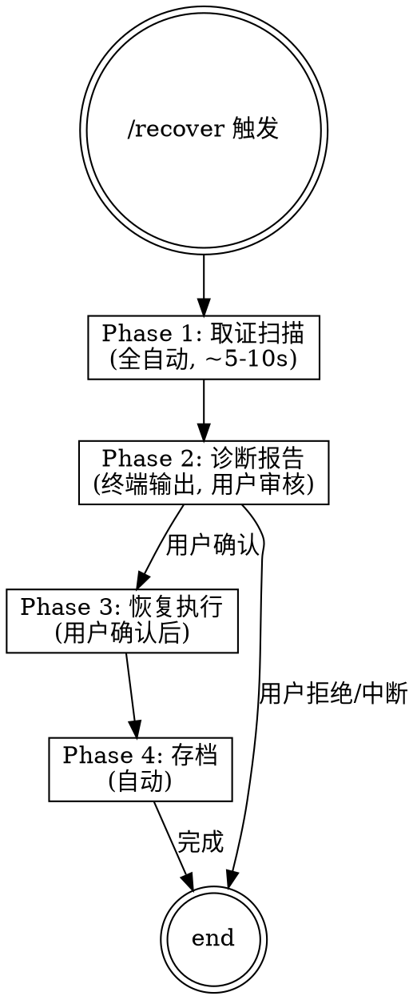

# /recover 命令设计文档

**日期**: 2026-06-14  
**状态**: 待审核  
**目标**: 新增 `/recover` slash 命令，在 Claude Code 闪退后快速诊断 + 恢复丢失代码

---

## 问题背景

Claude Code 2.1.162 (Bun runtime) 存在崩溃 bug，深嵌套 Agent 链 + ShellError 触发 SIGKILL。用户已遭遇多次闪退（3次记录），均发生在代码修改过程中，导致未 commit 的改动丢失。

现有防护措施（debug 模式、分批测试、agent 深度限制）已写入 CLAUDE.md，但缺少：
1. 闪退后的自动化诊断工具
2. 从 transcript JSONL 快速恢复代码的命令
3. 崩溃模式的历史记录和对比

## 方案：一体式 `/recover` 命令

单入口四阶段流程，支持半自动（先诊断报告 → 用户确认 → 执行恢复）。

## 架构



### Phase 1: 取证扫描（全自动）

**步骤**:

1. **读取 debug.log**: 扫描 `~/.claude/debug.log`，查找关键信号：
   - `SIGKILL` / `exit 137` / `exit code 137`
   - `ShellError`
   - `Bun.*panic` / `Bun.*crash`
   - `OOM` / `out of memory`
   - `is_running_with_bun: true`

2. **读取 telemetry**: 扫描 `~/.claude/telemetry/` 最新条目，获取 session ID、query depth、时间戳

3. **定位 transcript**: 
   - 扫描 `~/.claude/projects/D--YBCO-VNAMeas-Auto-Sweep/*.jsonl`
   - 按修改时间取最新 1-2 个
   - 优先取当前 session 对应的 transcript

4. **解析 transcript**:
   - 找到最后一次 `git commit` 之后的所有 Write/Edit 操作
   - 标记每个操作的状态：已落盘 ✓ / 仅 transcript ⚠️
   - 提取关键操作链（最后 10 个操作）

5. **检查工作区状态**: `git diff HEAD --stat` / `git status`

6. **读取历史崩溃 memory**: 对比之前的崩溃签名，计算相似度

**输入**:
- `~/.claude/debug.log` (最后 200 行)
- `~/.claude/telemetry/` (最新条目)
- 项目 transcript JSONL (最新 1-2 个)
- Git 状态

**输出**:
- 诊断数据结构: `{crash_type, trigger, log_lines, operation_chain, lost_files, historical_match, recommendation}`

### Phase 2: 诊断报告（终端输出）

报告分 5 个区块：

#### 区块 1: 结论（1 行摘要）
```markdown
## 💥 崩溃诊断
**类型**: [Bun SIGKILL | ShellError传播 | OOM Kill | 未知]
**触发**: [具体触发条件]
```

#### 区块 2: 关键日志（10-30 行原文）
```markdown
## 📋 关键日志
[debug.log 提取的关键行，带时间戳]
```

#### 区块 3: 操作链（崩溃前最后 N 个操作）
```markdown
## 🕐 崩溃前操作时间线
| 时间 | 操作 | 文件 | 状态 |
|------|------|------|------|
| HH:MM | Write/Edit/Bash | file.py | ✓/⚠️ |
| HH:MM | [CRASH] | - | - |
```

#### 区块 4: 丢失文件清单
```markdown
## 📋 丢失文件
| 文件 | 操作类型 | 可恢复性 |
|------|----------|-----------|
| file.py | Edit/Write | 可从 transcript 恢复 |
| file2.py | Edit/Write | ⚠️ old_string 可能不匹配 |
```

#### 区块 5: 历史对比 & 建议
```markdown
## 📊 历史对比
**本次签名**: [crash-signature]
**匹配历史**: 
- #1 (date) 相似度 XX%
- #2 (date) 相似度 XX%

## 🔧 建议
1. [具体操作建议]
2. [防护建议]
```

### Phase 3: 恢复执行（用户确认后）

**步骤**:

1. **Write 恢复优先**: 对每个丢失文件，取 transcript 中最后一次 Write 的完整内容，直接写入
2. **Edit 按序应用**: 对只有 Edit 的文件，按时间顺序依次应用 `str.replace(old_string, new_string)`
3. **冲突标记**: Edit 的 old_string 不匹配时，跳过并标记，生成 `.recover_conflict` 文件保留 new_string
4. **恢复摘要**: 输出成功/失败/冲突文件清单
5. **建议立即 commit**: `git add -A && git commit -m "recover: 从 transcript 恢复崩溃前改动"`

### Phase 4: 存档（自动）

**步骤**:

1. 将本次崩溃签名保存到 memory（`memory/crash-YYYYMMDD-HHMMSS.md`）
2. 如果发现新崩溃模式（与历史所有签名相似度 < 50%），建议更新 CLAUDE.md 防护规则
3. 更新 `MEMORY.md` 索引

## 崩溃签名格式

```yaml
signature: "<type>-<trigger>-<depth>"
type: bun_sigkill | shell_error | oom_kill | unknown
trigger: pytest_full_suite | deep_agent_chain | file_write_race | unknown
query_depth: <number>
timestamp: <ISO 8601>
session_id: <uuid>
lost_files: [list]
recovered: true | false | partial
```

## 诊断逻辑

```
如果 debug.log 包含 "exit code 137" + "is_running_with_bun: true"
  → 类型: Bun SIGKILL, 根因: Pytest 子进程 OOM

如果 debug.log 包含 "ShellError" + queryDepth > 30
  → 类型: ShellError 深层嵌套, 根因: Agent 链过深

如果 debug.log 包含 "out of memory" / "OOM"
  → 类型: OOM Kill, 根因: 系统内存不足

如果 transcript JSONL 最后一条是 Write/Edit 但文件未落盘
  → 丢失原因: Bun 在文件 I/O 完成前崩溃

其他情况
  → 类型: 未知, 保存全部日志供人工分析
```

## 文件结构

```
Auto_Sweep/
├── .claude/
│   └── skills/
│       └── recover.md              ← /recover skill 定义
├── docs/superpowers/specs/
│   └── 2026-06-14-recover-command-design.md  ← 本文档
└── memory/
    └── crash-*.md                  ← 崩溃记录存档
```

## 非功能需求

- Phase 1 扫描时间 < 10s（大 transcript 采样读取）
- 报告输出为纯文本 markdown（终端渲染）
- 恢复操作幂等（重复执行不产生重复文件）
- 不修改 `.git/` 中的任何内容

---

## Spec 自检

- [x] 无 TBD/TODO
- [x] 内部一致：四阶段流程衔接清晰
- [x] 范围可控：单 skill，不依赖外部服务
- [x] 无歧义：每个阶段的输入/输出明确定义
